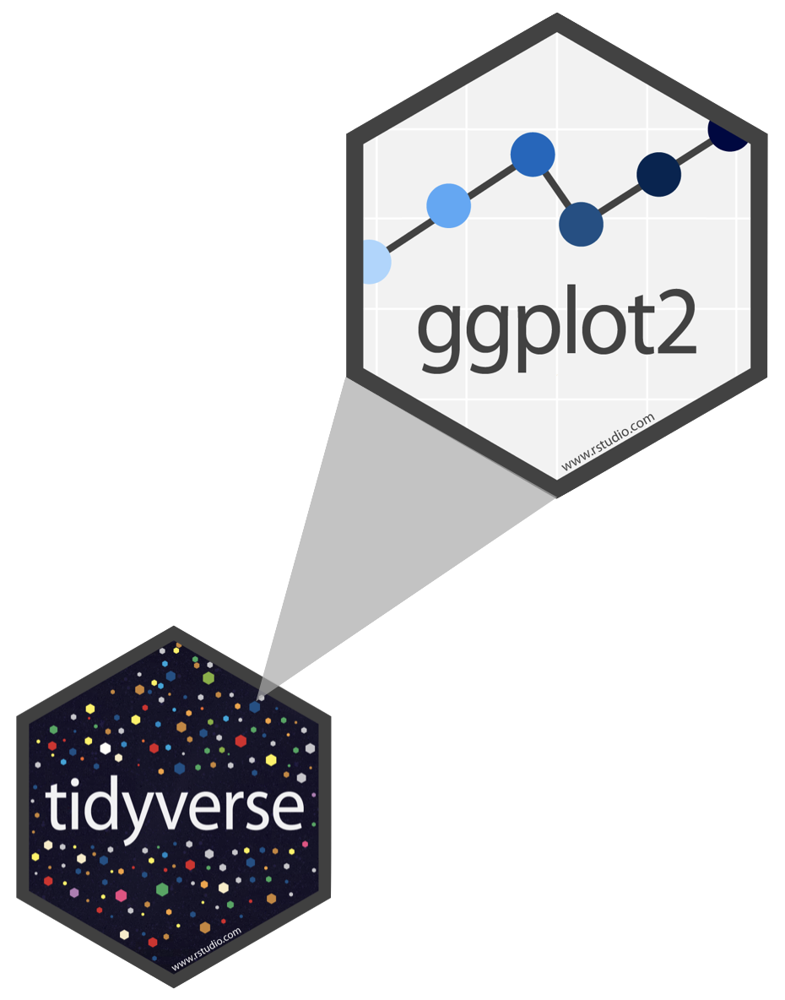

```{r setup, include=FALSE, message=FALSE, warning=FALSE}
#knitr::opts_chunk$set(echo = FALSE)
knitr::opts_chunk$set(echo = FALSE, fig.width = 6, fig.height = 4, fig.align = "center")
```

```{r, warning=FALSE, message=FALSE}
library(tidyverse)
```

# Girizgah

## Neden Buradayım 

```{r, out.width='50%', fig.align='center'}
knitr::include_graphics("edi.jpg")
```

- sizlerle tanışmak!

- Bir nevi konuşma temrini

- kendime notlar ve yeni şeyler öğrenme alanı

[Nelerle uğraşıyorum](https://oevkaya.netlify.app/home)

# Veri, Veri, Veri

> The representation of numbers … should be directly proportional to the numerical quantities measured. — Edward Tufte 1983

## Data representation 

- A dataset is a structured collection of data (observations or measurements (unprocessed or processed) of various data types: numbers, characters, factors, dates, etc.) associated with a unique field.
- Symbols that represent people, events, things or ideas etc. regarding the type that we are dealing with
- Humanities perspective:
  - "Almost nothing in the world IS data. ‘Data’ is an abstraction we use to make
certain kinds of inquiry possible.” [Natalia Cecire]
  – "Data is not a “given” but “taken actively” and constructed" [Johanna Drucker]
- Data Representation: The form in which data is stored and communicated, might differ in various ways (visualization, physi).

## Ne görüyorsunuz ?

```{r, out.width='60%', fig.align='center'}
knitr::include_graphics("Pastavilla_Bad.jpg")
```


## Peki bağlamı ekleyince

```{r, out.width='60%', fig.align='center'}


```


## Başka türlü olamaz mıydı?

```{r, out.width='50%', fig.align='center'}

```

## Data Visualization

- As a part of the general data representation, data visualization is very important ingridient of any data analysis workflow. 

> Data visualization plays a crucial role in transforming complex data into accessible and interpretable formats, including charts, graphs, scatter plots, or other visualization types (Gubala and Meloncon, 2022).

> “The representation and presentation of data to facilitate understanding”, framing comprehension as a dynamic process that involves perception, interpretation, and reasoning. (Kirk, 2016) 

- For the abstraction, sketching your ideas on a paper or screen is a kind of start all the time. Or maybe in today's computer-based era, inspring from available examples. 

# Two number examples

**In how many ways of representing/communicating two quantities? Such as 75,37** 

## So many 

```{r, out.width='50%', fig.align='center'}

```

[Source:](https://www.namwkim.org/datavis/slides/2.%20Data%20Visualization-%20The%20Good,%20the%20Bad,%20the%20Weird.pdf)

## Historical Examples

```{r, out.width='50%', fig.align='center'}

```

[A Brief History of Data Visualization](https://www.researchgate.net/publication/226400313_A_Brief_History_of_Data_Visualization/figures?lo=1)

## Historical Examples

```{r, out.width='50%', fig.align='center'}

```

[William Playfair, the father of statistical graphics](https://flourish.studio/blog/masters-william-playfair-father-of-statistical-graphics/)


## Historical Examples 

```{r, out.width='50%', fig.align='center'}

```

[Mapping a London Epidemic](https://education.nationalgeographic.org/resource/mapping-a-london-epidemic/)

## Historical Examples - Last but not least 

```{r, out.width='50%', fig.align='center'}

```


[Florence Nightingale: Pioneer of Data Visualization](https://www.datacamp.com/blog/florence-nightingale-pioneer-of-data-visualization)

## Why DataViz is powerful

Visualization leverages the human visual system to facilitate;

- Understanding
- Discovery
- Decision making
- Communication
- Memory

**Our brain is capable of quick and efficient visual information processing at a pre-conscious level**

## [Double Diamond Process](https://en.wikipedia.org/wiki/Double_Diamond_(design_process_model))

- **discover** : Understand the challenge/problem
- **define** : define the challenge/problem
- **develop** : explore different solutions
- **deliver** : testing different solutions

For data visualization task, we can imagine the nested model of the data visualization design process

- domain: Who are the target users?
- abstraction: What needs to be shown? Why should people look at it?
- (visual) encoding / interaction: What should be represented? How the representation can be manipulated
- format: How do we make it happen?

## About data visualisation guidelines

- **Structure of data** – attributes (types), data items or values
- Visual marks (geometries)/channels(controlling appearance of marks)
- Mapping data types to in different visual marks, channels
- Expressiveness - The visual encoding should express all of, and only, the information in the dataset attributes (matching channel and data characteristics)
- Effectiveness - The importance of the data attribute should be encoded with the most effective visual variable, in order to be noticeable

## Visual marks and channels

- Data  variables (attributes) are encoded in different ways
- Thinking through appropriateness of different channels is the key in an iterative way
- Some example marks and channels

```{r, out.width='50%', fig.align='center'}

```


## Effectiveness & Expressiveness

```{r, out.width='50%', fig.align='center'}

```


## Take a pause - What do you think?

```{r, out.width='50%', fig.align='center'}

```


## What about this one 

```{r, out.width='50%', fig.align='center'}

```

## Why Visualize - Repeating again

- See patterns, spot anomalies, generate questions. The purpose is to literally *see* what your data seems to say. Communicate findings clearly and persuasively.
- Start simple: summaries + visuals. (EDA mindset) and iterate to get a better version

Best final visual depends on;

- data types
- context of the data 
- tasks to perform
- questions to answer
- messages to deliver 

> *"The simple graph has brought more information to the data analyst's mind than any other device." --- John Tukey*

## What is EDA?

- Exploratory data analysis (EDA) is the first step in **understanding** the main features and structures of a data set.
- Many statistical tools and techniques are used when performing EDA, but crucially they are **simple** to allow the data __speak__ for itself.
- Tools that a data scientist may use are:
  - Data transformation/wrangling
  - Calculation of simple summary statistics (mean, median, variance, correlation, etc.)
  - Tabulation, Graphical or visual representations

> *"Although we often hear that data speak for themselves, their voices can be soft and sly." --- Mosteller et al. (1983)*

## Anscombe Data 

```{r, out.width='50%', fig.align='center'}

```

[Another example from our Data science course](https://uoeids.github.io/slides/w05-L10/w05-L10.html?panelset_002=statistics#7)

## Data Storytelling

```{r, out.width='30%', fig.align='center'}

```


Source for Example: Storytelling with data a data visualization guide for business professionals
Knaflic, Cole Nussbaumer, Wiley, 2015

# R içerisinde neler var? 

> *"Data and information visualization is concerned with showing quantitative and qualitative information, so that a viewer can see patterns, trends or anomalies, constancy or variation, in ways that other forms—text and tables—do not allow" --- Michael Friendly*

## ggplot2 $\in$ tidyverse

- The most widely used R package for graphics.

```{r echo=FALSE, out.width="20%"}

```

- **ggplot2** is tidyverse's data visualization package 
- `gg` in "ggplot2" stands for *Grammar of Graphics* from the book by Leland Wilkinson

## Main layers of the grammer

```{r echo=FALSE, out.width="70%"}
knitr::include_graphics("grammar-of-graphics.png")
```


## Structure of creating a plot

- `ggplot()` is the main function in ggplot2
- Construct plots by _adding_ (`+`) layers -- **Not** the `%>%` pipe!

- Many types of geometries:
  - `geom_points()`, `geom_histogram()`, `geom_line()`, `geom_boxplot()`, etc.

- [ggplot2 cheat sheet](https://www.rstudio.com/resources/cheatsheets/)


## General Usage

```{r, echo = TRUE, eval=FALSE}
ggplot(data = [dataset], # Data 
       # Aesthetics
       mapping = aes(x = [x-variable], y = [y-variable])) +   
  # Geometries
   geom_[*]() +  
  # ...
   other options/layers when you needed                                                 
```

## Example: Palmer Penguins

Measurements for penguin species, island in Palmer Archipelago, size (flipper length, body mass, bill dimensions), and sex.

```{r eval=TRUE}
library(palmerpenguins)
glimpse(penguins)
```

## Example: Penguins dataset

```{r penguins, echo = FALSE, fig.align = "center", fig.width = 6, fig.asp = 1, out.width = "50%", warning = FALSE}
penguins <- palmerpenguins::penguins
ggplot(data = penguins, 
       mapping = aes(x = bill_depth_mm, y = bill_length_mm,
                     colour = species)) +
  geom_point() +
  labs(title = "Penguin bill depth & length",
       x = "Bill depth (mm)", 
       y = "Bill length (mm)",
       colour = "Species")
```


## Example: Penguins dataset

```{r, eval = FALSE, echo=TRUE,fig.align = "center", fig.width = 6, fig.asp = 1, out.width = "50%", warning = FALSE}
penguins <- palmerpenguins::penguins
ggplot(data = penguins, 
       mapping = aes(x = bill_depth_mm, y = bill_length_mm,
                     colour = species)) +
  geom_point() +
  labs(title = "Penguin bill depth & length",
       x = "Bill depth (mm)", 
       y = "Bill length (mm)",
       colour = "Species")
```

## And iterate ...

* Editing the aesthetic options: Point colour, size, shape, etc.
* Specify the limits of the co-ordinate axes to zoom in or out.
* Include additional descriptive information: sub-title, caption, data source citation, etc.
* Add other graphical information: line/curve of best fit, arrows, estimation intervals, etc.
* Faceting/panelling multiple plots into a grid.
* Changing the colour pallet that is more accessible for colour blindness.
* ...

**However**, more is not necessarily good - there should be certain design choices 

## Understanding your data

* There are many types of data visualisation, each designed with a particular purpose.
* To determine which visualisation style is appropriate, consider:

  1. What are the properties of variables?
  2. How many variables to include (are necessary) in the data visualisation?
  3. What aspect of the data do you want to explore, investigate and communicate?
  
## Types of variables

- **Quantitative variables** are variables whose data are numerical values.
  - **Discrete variables** describes count data, typically non-negative integer values. <br />
    Eg, Number of IDS students or number of election votes.
  - **Continuous variables** are typically real-valued measurements, rounded to a specified number of decimal places or significant figures. <br />
    Eg, Penguin bill length, body mass and flipper length.

## Types of variables

- **Qualitative variable** are variables that are descriptive.
  - **Categorical (factor) variables** usually identify one option from a small set of cases. <br />
    Eg, Penguin breeds (Adelie, Chinstrap or Gentoo).
  - **Ordinal variables** are categorical variables that have a natural ordering. <br />
    Degree grades: First, upper-second, lower-second and third.

[From Data to Viz](https://www.data-to-viz.com/)

## Number of variables involved

- One variable (Univariate data analysis)
  - What is the _location_, _spread_ and _shape_ of the data?
  - Types of visualisations:**histogram**, **box plot**, **bar chart**, etc.
- Two variables (Bivariate data analysis)
  - Investigating the relationship between two variables. Positive/negative correlation? Linear or non-linear relationship?
  - Types of visualisations: **scatter plot**, **box plots**, **segmented bar plot**, etc.
- Three or more variables (Multivariate data analysis)
  - Investigating the relationship between many variables simultaneously.
  - Use of **colour**, **style** and **faceting** - be creative!
  
## Motivating Data Set: Bats 

* Extracted from the [Atlantic Mammal Traits](https://esajournals.onlinelibrary.wiley.com/doi/10.1002/ecy.2106) survey on animal morphology.
* Data contains information about 4334 Neotropical fruit bats (_Aribeus_) from South America between 2010-2017.

```{r load-data, message = FALSE}
bat_data <- read_csv("bats.csv")
glimpse(bat_data)
```


## Data Dictionary

| Variable    | Description | Type |
|:------------|:------------|:-----|
| `species`   | Name of bat species | Categorical (5 cases) |
| `body_mass` | Body mass (in grams)| Numerical, continuous |
| `forearm`   | Forearm length (in mm) | Numerical, continuous |
| `age`       | Adult or Juvenile | Categorical (2 cases) |
| `sex`       | Female or Male | Categorical (2 cases) |
| `year`      | Year of measurement | Numerical, discrete |

## Histogram by default 

```{r message = TRUE, out.width = "50%", fig.height = 5, fig.width = 8, fig.align='center'}
ggplot(data = bat_data, 
       mapping = aes(x = body_mass)) +
  geom_histogram()
```


* Message specifies the use of default/assumed values

## Histogram by certain modifications 

```{r hist-col, echo=FALSE, warning = FALSE}
ggplot(data = bat_data, 
       mapping = aes(x = body_mass)) +
  geom_histogram(
    bins = 30,
    fill = "darkcyan", #<<
    colour = "darkblue"   #<<
    ) +     
  labs(
    x = "Body mass (in grams)",
    y = "Frequency",
    title = "Body mass of fruit bats",
    subtitle = "(2010-2017)"
    ) +
  theme_bw()
```


## Density plot

```{r density-custom, warning = FALSE}
ggplot(data = bat_data, 
       mapping = aes(x = body_mass)) + 
  geom_density(
    fill = "darkcyan"
    ) +   
  labs(
    x = "Body mass (in grams)",
    y = "Density",
    title = "Body mass of fruit bats",
    subtitle = "(2010-2017)"
    ) +
  theme_bw()
```


## Box plot

```{r boxplot, warning = FALSE}
ggplot(data = bat_data, 
       mapping = aes(x = body_mass)) + 
  geom_boxplot( ) +   #<<
  labs(
    x = "Body mass (in grams)",
    title = "Body mass of fruit bats",
    subtitle = "(2010-2017)"
    ) +
  theme_bw()
```


## Adding a categorical variable via aesthetics

```{r density multiple, warning = FALSE}
ggplot(data = bat_data, 
       mapping = aes(
         x = body_mass,
         fill = species   #<<
         )) +
  geom_density(
    alpha = 0.5 #<<
    ) +
  labs(
    x = "Body mass (in grams)",
    y = "Density",
    title = "Body mass of fruit bats,",
    subtitle = "by species" ) 
```

## Via facetings

As a 2x2 setting

```{r grid, warning = FALSE}
ggplot(data = bat_data, 
       mapping = aes(x = body_mass)) +
  geom_histogram(bins = 30) +
  labs(
    x = "Body mass (in grams)",
    y = "Frequency",
    title = "Body mass of fruit bats,",
    subtitle = "by age and sex" )  +
  facet_grid(age ~ sex,       #<<
             scale = "free")  #<<

```


## Data visualisation gallery

* `ggplot2` is used to create a wide variety of data visualisation styles. It has many customisation tools to support your communication.
* Use `ggplot2` manual pages (and online searches) to support your creation.
* Specific starting point would be [R Graph gallery](https://r-graph-gallery.com/)

* **But**, excessive customisation can be distracting.
* In general, there are various resources to explore 

# Her veri kendine has görsel istiyor

## Covid19 çalışmasına dair 

```{r, out.width='60%', fig.align='center'}

```

[Leveraging Ensemble and Hybrid Forecasting Tools to Increase Accuracy: Turkey COVID-19 Case Study](https://link.springer.com/article/10.1007/s42979-025-03658-2)

## GenAI survey çalışması

```{r, out.width='60%', fig.align='center'}

```

[Mathematics Students' Adoption and Perceptions of Generative AI tools -Results from a Survey](https://github.com/oevkaya/GenAI-Edi-Survey)

## Scottish Deprivation data

```{r, out.width='60%', fig.align='center'}

```


[Cluster-specific ranking and variable importance for Scottish regional deprivation via vine mixtures](https://arxiv.org/abs/2508.04533)

## Öğrenci projelerinden

```{r, out.width='60%', fig.align='center'}

```

## Öğrenci projelerinden

```{r, out.width='60%', fig.align='center'}

```

UG project: Clustering Dementia Characteristics Using Vine Copula Mixture Models

## Ogrenci projelerinden

```{r, out.width='60%', fig.align='center'}

```

[Machine Learning Meets Hospitality: Explainable AI in Hotel Booking Cancellations](https://hotel-booking-dashboard.streamlit.app/)

## Öğrenci projelerinden - ERASMUS+ Internship

```{r, fig.show='hold', out.width='39%', fig.align='center'}
knitr::include_graphics(c("Erasmus_BarPlot.jpg", "Erasmus_Maps.jpg"))
```

## Öğrenci projelerinden - ERASMUS+ Internship

```{r, out.width='60%', fig.align='center'}
knitr::include_graphics(c("Erasmus-Normality.jpg"))
```


## Teaching odaklı kullanım 

- Shiny based web apps for specific topics 

- Targeting visual learners with interactivity, implemented in some courses such as Statistics or Data Science

- One example if time allows! - LATER

# ggplot ve ötesine dair

## Very promising: Lots of ggplot2 extensions 

- [151 registered extensions available](https://github.com/erikgahner/awesome-ggplot2) to explore
- There are created with the same grammer of graphics approach so that they are following similar syntax behind the scene mostly 
  - Specific packages for specific tasks can be found such as **patchwork**, **gganimate**, **esquisse**, **ggcorplot** etc. 

- Various packages designed for customization and additional theme usage such as **ggthemes**, **ggpubr**
- Some packages are tailored to additional information on top of the visualization such as **ggstatsplot**

## Interactive & Web-Based Visuals

| Package         | Interactivity                | Typical Tasks                         | Standout Strengths                                                                                                  |
| --------------- | ---------------------------- | ------------------------------------- | ------------------------------------------------------------------------------------------------------------------- |
| **plotly (R)**  | Interactive (HTML)           | Dashboards, rich interactive plots    | Supports many chart types—including 3D, contour, maps—and works offline                      |
| **highcharter** | Interactive (JS via R)       | Themed charts, interactive dashboards | Leverages Highcharts JS with professional themes (“economist”, “FT”, “538”)                        |
| **leaflet (R)** | Interactive maps             | Web maps with markers, layers         | R binding for Leaflet.js; great for interactive maps in Shiny/R Markdown |
| **dygraphs**    | Interactive (JS time series) | Time-series charts with brushing      | Handles large time-series efficiently, integrates RColorBrewer palettes                              |                                                |

## Additional Tools & Enhancements

- **gganimate** — Add frame-based animations to plots; treat time as an aesthetic. Ideal for dynamic visual storytelling.
- **ggthemes** — Offers extra pre-designed themes and color scales beyond ggplot2 defaults.
- **ggpubr** — Simplifies the creation of publication-ready plots, especially statistical plots like boxplots, histograms, and violin plots.
- **patchwork** — Aids in composing multiple ggplot2 plots into complex layouts easily.
- **RColorBrewer** – Static; provides beautiful sequential/diverging palettes, enhances maps and plots 
- **Esquisse** – Interactive GUI; drag‑and‑drop to build ggplot2 charts and extract code 
- **GGally** — Extends ggplot2 with tools like ggpairs for easy pairwise plots and correlation matrices.


## Quick Reference: Which to Use When?

- Data transformation pipelines? → tidyverse (especially ggplot2 as the viz endpoint)
- Custom, publication-quality 2D plots? → ggplot2
- Faceted, multivariate plots? → lattice or ggplot2 with suitable faceting and customization
- Browser-based interactive charts? → plotly, leaflet
- 3D interactive graphics, including functions modelled on base graphics → RGL
- Palette design or themes? → ggthemes
- Prefer a GUI to build plots? → Esquisse
- Web app based interactive examples → Shiny 

# Bazı kaynaklara dair
  
## RSS: Best Practices for Data Visualisation

- **[Best Practices for Data Visualisation](https://royal-statistical-society.github.io/datavisguide/)** aims to equip readers with the fundamentals for creating data visualizations that are high-quality, readable, impactful, and accurate in both presentation and interpretation.

- The guide blends both the scientific and creative aspects of visualization — it emphasizes that data viz is not just plotting defaults, but actively telling a story and choosing design elements deliberately to serve that story

- Though primarily aimed at RSS publications (Significance magazine, JRSS Series A, Real World Data Science), the guidance is broadly relevant for any data viz task

*Thanks to Andreas Krause, Nicola Rennie, and Brian Tarran*

## Principles & Choosing Chart Types

To select the right chart type, consider:

1. **Data type** (e.g., numeric, categorical) — tools like *From Data to Viz* use decision trees to suggest suitable chart formats.
2. **Data relationship** (e.g., correlation, ranking, deviation) — platforms like *Visual Vocabulary* guide selection based on the main relationship you want to show

Checklist:

- Be clear on the visualization's purpose.
- Know your audience.
- Choose chart type based on data structure or relationship.
- Refine with audience’s graph literacy in mind

## Styling & Accessibility

Emphasis is placed on styling for **accessibility**, using thoughtful choices in color, annotation, fonts, and alternative text

- **Unstyled** version uses default colors and labels.
- **Styled** version includes readable font sizes, contrast-aware color fills, in-chart labels, and clear titles/subtitles — vastly improving interpretability

Key styling components:

- Accessible color palettes.
- Effective annotations.
- Legible font sizes and styles.
- Alt text for visual inclusion

## From data to viz 

- Where to start might not be easy, so good to explore already published good images

- There are specific visual galleries for both R and Python with code and created images 

- In terms of understanding the visual type, when to apply, [From Data to Viz](https://www.data-to-viz.com/)

Projelerde iyi bir eşlikçi olabilir...

## What about the Python world ? See the repo!

- In my view (possibly biased but I am happy about it), R seems still more powerful compared to python regarding the available packages/tools
- However, there is a growing list of python libraries with a community also 
- In terms of your general programming habits you can start the safest position
- There are nowadays more common packages for both landscape 

# Peki ya AI etkisi?

## Data Automation

```{r, out.width='50%', fig.align='center'}

```


## AI + Data Visualization 

```{r, out.width='50%', fig.align='center'}

```

[Decoding AI: The inside story of data analysis in ChatGPT](https://arxiv.org/abs/2404.08480)

## GAIL project Örneği

```{r, out.width='45%', fig.align='center'}

```


[GAIL project report: LLMs are they ready for DS?](https://github.com/oevkaya/GAIL-DS-project/blob/main/Supplementary.pdf)

## LLMs her yerde?

- Bazı R ya da Python paketlerinde LLM based destek, PandasAI gibi 

- Code generation is being easier - Github Copilot

- Specific package AI helper, such as Shiny Assistant


## Neler olabilir ? 

- AI destekli DataViz daha belirgin olacak ancak, dizayn ve yorumlama açısından bize aktif rol düşüyor ve düşmeli!

- Programlama dillerinde data viz hazırlarken, daha çok LLM desteği olabilir, diğer bir deyişle görseli konuşarak çizmeye başladık çoktan bu daha da yaygınlaşabilir

- Shiny based vb platformların kullanıcıya sunacağı esneklikler ve kullanıcı sorgusu odaklı alternatifler anında oluşturulabilir

- İşin dizayn tarafı ve yorumlanması yine çok önemli o yüzden bu tarz örneklerle bol bol ilgilenmek, farklı verilerin grafikleri neler söyler anlayabilmek önemli


## Neler yapmalı ?

- Bol bol denemeler yapmakta fayda var- ne demişler no pain no gain yahut emeksiz yemek olmaz 

- Açık kaynak örneklerden bol bol yararlanıp, onları yeniden üretme oyunları oynamak iyi bir aktivite olabilir 

- Örnek alınacak belirli isimleri takip etmekte ve okuduğumuz yazıların görsellerini kritik bir gözle incelemekte fayda var, [Cara Thompson](https://www.cararthompson.com/)

- Belirli gruplar ile veri görseli odaklı yarışmalar vb düzenlenebilir, online etkinlikler (R consortium, Python webinars gibi) düzenli takip edilebilir

- R ve pythonda olan paket ve örneklerin hangi durumlarda nasıl işe yarayacağı ara ara düzenli okuma ve takiplerle bir düzenli takip alışkanlığına getirilebilir

## İyi Kötü Çirkin 

```{r, out.width='100%', fig.align='center'}

```

## Yolda gelirken 

```{r, out.width='30%', fig.align='center'}

```

Kaynak: Herkese Bilim Teknoloji Gazetesi, Sayı 493

## Yolda gelirken 2 

```{r, out.width='50%', fig.align='center'}

```

Kaynak: Herkese Bilim Teknoloji Gazetesi, Sayı 493

## Yolda gelirken 3 

```{r, out.width='50%', fig.align='center'}

```

Kaynak: Oksijen Gazetes, Financial Times eki

## Bazı Okumalara dair

- [Data Visualization The Good, the Bad, the Weird, Nam Wook Kim](https://www.namwkim.org/datavis/slides/2.%20Data%20Visualization-%20The%20Good,%20the%20Bad,%20the%20Weird.pdf)

- [Data visualization in AI-assisted decision-making: a systematic review](https://www.frontiersin.org/journals/communication/articles/10.3389/fcomm.2025.1605655/full)

- [From Data to Viz](https://www.data-to-viz.com/)

- [Fundamentals of Data Visualization](https://clauswilke.com/dataviz/proportional-ink.html)

## Kolokyum Sonrası

> Bir sincap gibi gezdim durdum <br> 
> Şimdilik huzuru Edinburgh da buldum <br> 
> Cagrimdir meraklisina R ile veriyi cizedursun <br>
> Yolu beraber yürümek isteyenler isterse beni bulsun :)

- Bu sunum ve içindeki görseller için: **https://github.com/oevkaya/18StatColloqTalk**

- [Hakkımda](https://oevkaya.netlify.app/home) - https://oevkaya.netlify.app/home

- [Linkedin](https://www.linkedin.com/in/ozanevkaya/)

- [GitHub](https://github.com/oevkaya) - https://github.com/oevkaya

- [ResearchGate](https://www.researchgate.net/profile/Ozan-Evkaya)

- [Instagram](https://twitter.com/ozanevkaya)

